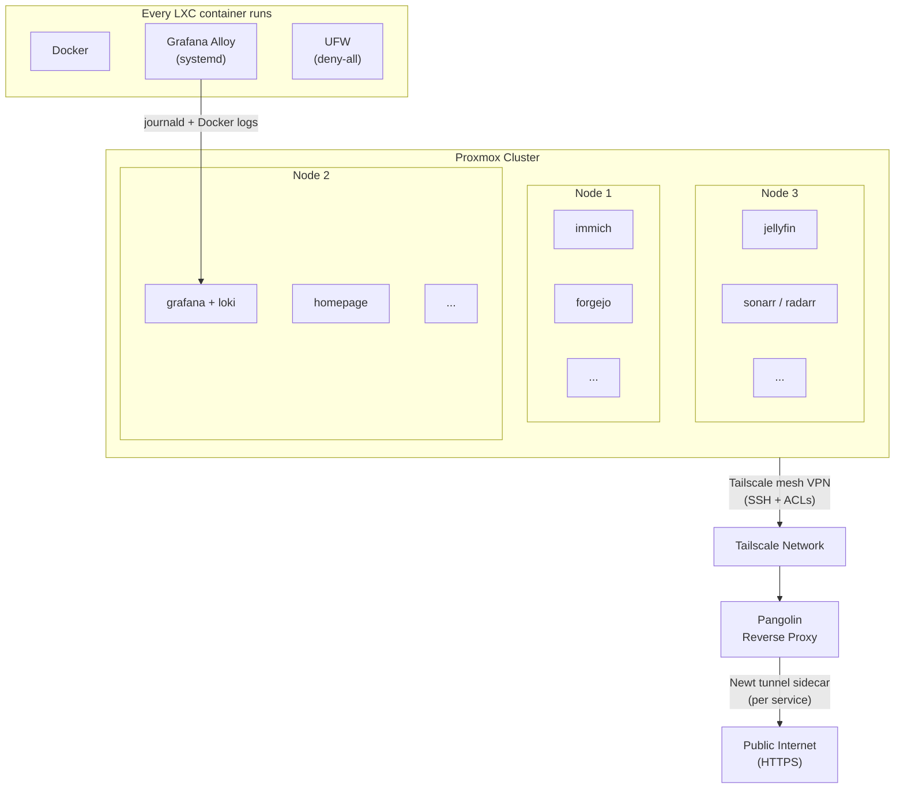

# homelab

This repo contains [Ansible playbooks](./ansible/playbooks/) and Docker Compose files that provision and manage a fully self-hosted homelab running on [Proxmox](https://proxmox.com).

Every service lives in its own LXC container running Ubuntu. Ansible deploys Docker and a `docker-compose.yml` to each container; [Tailscale](https://tailscale.com) handles all networking; [Grafana Alloy](https://grafana.com/docs/alloy/) ships logs to Loki.

> **Why Proxmox + LXC instead of a single Docker host?**
> Proxmox makes it trivial to snapshot, backup, and live-migrate individual services between nodes from a single web UI. LXC containers are lightweight enough that 36+ services run comfortably without fighting for resources.

---

## Architecture



Each LXC container runs:
- **Docker** (installed via Ansible)
- **Grafana Alloy** (systemd service — ships journald + Docker logs → central Loki)
- **UFW** (deny-all inbound; only Tailscale traffic is accepted)

---

## Services

### 🤖 AI & Smart Search

| Service | Description |
|---|---|
| [Immich](https://immich.app) | Self-hosted Google Photos replacement with ML-powered face recognition, CLIP semantic search, and smart albums |
| [Paperless-ngx](https://docs.paperless-ngx.com) | AI-assisted document management with automatic tagging, classification, and OCR |
| [SearXNG](https://searxng.github.io/searxng/) | Privacy-respecting meta search engine; also used as a retrieval backend for LLM agents |

### 📸 Media & Entertainment

| Service | Description |
|---|---|
| [Jellyfin](https://jellyfin.org) | Open-source media server for movies, TV, and music |
| [Navidrome](https://navidrome.org) | Subsonic-compatible music streaming server |
| [Audiobookshelf](https://www.audiobookshelf.org) | Self-hosted audiobook and podcast server |
| [Tunarr](https://github.com/chrisbenincasa/tunarr) | Create custom IPTV channels from local media |
| [Dispatcharr](https://github.com/Dispatcharr/Dispatcharr) | IPTV playlist and EPG manager |
| [Invidious](https://invidious.io) | Privacy-respecting YouTube frontend |
| [RomM](https://github.com/rommapp/romm) | ROM manager and game library for retro games |
| [Minecraft Bedrock](https://www.minecraft.net) | Bedrock edition game server |
| [Sonarr](https://sonarr.tv) | TV series management and automation |
| [Radarr](https://radarr.video) | Movie management and automation |
| [Lidarr](https://lidarr.audio) | Music management and automation |
| [Prowlarr](https://github.com/Prowlarr/Prowlarr) | Indexer manager for the \*arr ecosystem |
| [qBittorrent](https://qbittorrent.org) | BitTorrent client |
| [Seerr](https://github.com/seerr-team/seerr) | Media request management (Overseerr fork) |
| [FlareSolverr](https://github.com/FlareSolverr/FlareSolverr) | Cloudflare bypass proxy for indexers |

### 🗂️ Productivity & Knowledge

| Service | Description |
|---|---|
| [Miniflux](https://miniflux.app) | Minimalist RSS reader |
| [ArchiveBox](https://archivebox.io) | Self-hosted internet archiving |
| [Kiwix](https://kiwix.org) | Offline access to Wikipedia, Stack Overflow, and more |
| [Maloja](https://github.com/krateng/maloja) | Self-hosted scrobbling server (Last.fm alternative) |
| [LubeLogger](https://lubelogger.com) | Vehicle maintenance tracker |
| [Bento PDF](https://github.com/alam00000/bentopdf) | PDF manipulation tool |

### 🏠 Home Dashboard

| Service | Description |
|---|---|
| [Homepage](https://gethomepage.dev) | Highly customizable services dashboard with live widget integrations |

### 🔔 Notifications

| Service | Description |
|---|---|
| [Gotify](https://gotify.net) | Self-hosted push notification server |
| [Apprise](https://github.com/caronc/apprise) | Multi-platform notification gateway |
| [iGotify](https://github.com/androidseb25/igotify-notification-assist) | iOS push notification bridge for Gotify |

### 🌐 Networking & Security

| Service | Description |
|---|---|
| [AdGuard Home](https://adguard.com/adguard-home.html) | Network-wide DNS ad and tracker blocking |

### 🔧 Developer Tools

| Service | Description |
|---|---|
| [Forgejo](https://forgejo.org) | Self-hosted Git service (Gitea fork) |
| [Umami](https://umami.is) | Privacy-focused website analytics |

### 📊 Observability Stack

| Service | Description |
|---|---|
| [Grafana](https://grafana.com) | Metrics and log dashboards |
| [Loki](https://grafana.com/oss/loki/) | Log aggregation backend, receives from all Alloy agents |
| [Gatus](https://gatus.io) | Automated service health monitoring with alerting |
| [Beszel](https://github.com/henrygd/beszel) | Lightweight server monitoring hub |
| [Speedtest Tracker](https://github.com/linuxserver/docker-speedtest-tracker) | Scheduled internet speed history |
| [WatchYourLAN](https://github.com/aceberg/watchyourlan) | Network IP scanner and device tracker |
| [ChangeDetection.io](https://changedetection.io) | Website change monitoring and alerting |

---

## Networking

All hosts run **Tailscale** with [Tailscale SSH](https://tailscale.com/kb/1193/tailscale-ssh) enabled — there are no open SSH ports on the public internet. Tailscale ACLs tag and restrict which nodes can reach each other.

For public-facing services, a **[Pangolin](https://github.com/fosrl/pangolin)** reverse proxy is provisioned separately. Each service that needs public exposure runs a **Newt** sidecar container that tunnels traffic outward from Pangolin — no inbound firewall rules required:

```yaml
newt:
  image: docker.io/fosrl/newt:1.14.0
  container_name: newt-<service>
  restart: unless-stopped
  environment:
    - PANGOLIN_ENDPOINT={{ pangolin_endpoint }}
    - NEWT_ID={{ service_newt_id }}
    - NEWT_SECRET={{ service_newt_secret }}
```

For Tailnet-only services, [tailscale serve](https://tailscale.com/kb/1242/tailscale-serve) provides HTTPS with automatic Let's Encrypt certificates.

---

## Logging

Every host runs **[Grafana Alloy](https://grafana.com/docs/alloy/)** as a systemd service. It ships two log streams to a central Loki instance:

- **journald** — all systemd unit logs, labelled with `host` and `unit`
- **Docker** — all container logs, labelled with `host` and `container` name

Any service's logs are searchable in Grafana within seconds of emission, across all hosts in a single LogQL query.

---

## Setup

### Prerequisites

- A Proxmox cluster with LXC containers provisioned and named to match `ansible/inventory`
- Tailscale installed on each container (playbooks assume Tailscale SSH as the only access method)
- Ansible Vault password written to `ansible/.vault_pass`

### Developer Environment

A [Nix flake](./flake.nix) provides a reproducible dev shell with all required tools:

```sh
nix develop   # provides: ansible, just
```

Or install manually: `ansible`, `just`.

### Running Playbooks

All commands are run from the `ansible/` directory:

```sh
# Install required Ansible Galaxy collections
just setup

# Run all playbooks
just run ""

# Run a single service
just run "--limit immich"

# Run one playbook directly
ansible-playbook playbooks/immich/main.yml -i inventory --vault-password-file .vault_pass
```

### Adding a New Service

1. Add the hostname to `ansible/inventory` under `[homelab]` (alphabetical order)
2. Create `ansible/playbooks/<service>/main.yml` following the [canonical structure](./AGENTS.md#playbook-structure-canonical-form)
3. Create `ansible/playbooks/<service>/docker-compose.yml` following [compose conventions](./AGENTS.md#docker-compose-conventions)
4. Add an `import_playbook` line to `ansible/playbooks/main.yml`
5. Reference secrets via `{{ variable }}` and define them in `group_vars/all/secrets.yaml` (Ansible Vault encrypted)

---

## CI/CD

| Trigger | Action |
|---|---|
| Push to `main` | All playbooks run via GitHub Actions matrix against real infrastructure |
| Manual dispatch | Run a single playbook by name via `run-single-playbook.yml` |
| Compose file change | `update-containers-table.yml` regenerates the image index below |

The vault password is injected via `secrets.ANSIBLE_VAULT_PASSWORD`.

---

## Maintenance

[Renovate](https://docs.renovatebot.com) monitors all Docker image versions and opens PRs with updates. All images are pinned to specific versions **and** SHA digests (e.g., `image:v1.2.3@sha256:abc123`) to prevent silent supply-chain drift. Custom versioning rules handle date-versioned images like SearXNG and Invidious.

[ProxMenux](https://github.com/MacRimi/ProxMenux) is used to run update scripts and monitor key vitals of running Proxmox nodes.

---

## Container Image Index

<!-- DOCKER_SERVICES_START -->
| Image | Version |
|-------|---------|
| codeberg.org/forgejo/forgejo | 15.0.5 |
| data.forgejo.org/forgejo/runner | 12 |
| docker.io/aceberg/watchyourlan | v2 |
| docker.io/adguard/adguardhome | v0.107.78 |
| docker.io/archivebox/archivebox | 0.7.4 |
| docker.io/caronc/apprise | v1.5.1 |
| docker.io/chrisbenincasa/tunarr | 1.3.8 |
| docker.io/deluan/navidrome | 0.63.2 |
| docker.io/dgtlmoon/changedetection.io | 0.55.7 |
| docker.io/docker | 29.6.1-dind |
| docker.io/fosrl/newt | 1.14.0 |
| docker.io/gotify/server | 2.9.1 |
| docker.io/grafana/grafana | 13.1.0 |
| docker.io/grafana/loki | 3.7.3 |
| docker.io/henrygd/beszel | 0.18.7 |
| docker.io/itzg/minecraft-bedrock-server | 2026.7.3 |
| docker.io/jellyfin/jellyfin | 10.11.11 |
| docker.io/krateng/maloja | 3.2.4 |
| docker.io/library/redis | 8 |
| docker.io/linuxserver/lidarr | 3.1.0 |
| docker.io/linuxserver/prowlarr | 2.4.0 |
| docker.io/linuxserver/qbittorrent | 5.2.3 |
| docker.io/linuxserver/radarr | 6.2.1 |
| docker.io/linuxserver/sonarr | 4.0.19 |
| docker.io/linuxserver/speedtest-tracker | 1.14.5 |
| docker.io/mariadb | 12.2.2 |
| docker.io/miniflux/miniflux | 2.3.2 |
| docker.io/paperlessngx/paperless-ngx | 2.20.15 |
| docker.io/postgres | 18.4 |
| docker.io/rommapp/romm | 4.9.2 |
| docker.io/searxng/searxng | 2026.7.12-c19d86faa |
| docker.io/twinproduction/gatus | v5.36.0 |
| docker.io/valkey/valkey | 9 |
| ghcr.io/advplyr/audiobookshelf | 2.35.1 |
| ghcr.io/alam00000/bentopdf | 2.8.6 |
| ghcr.io/androidseb25/igotify-notification-assist | v1.5.1.3 |
| ghcr.io/dispatcharr/dispatcharr | 0.27.2 |
| ghcr.io/flaresolverr/flaresolverr | v3.5.0 |
| ghcr.io/gethomepage/homepage | v1.13.2 |
| ghcr.io/hargata/lubelogger | v1.4.5 |
| ghcr.io/immich-app/immich-machine-learning | v3.0.2 |
| ghcr.io/immich-app/immich-server | v3.0.2 |
| ghcr.io/immich-app/postgres | 14-vectorchord0.4.3-pgvectors0.2.0 |
| ghcr.io/kiwix/kiwix-serve | 3.8.2 |
| ghcr.io/seerr-team/seerr | v3.3.0 |
| ghcr.io/seriousm4x/upsnap | 5.4.2 |
| ghcr.io/umami-software/umami | 3.2.0 |
| quay.io/invidious/invidious | 2026.07.07-6373ac7 |
| quay.io/invidious/invidious-companion | 2026.07.14-d9b5379 |
<!-- DOCKER_SERVICES_END -->
